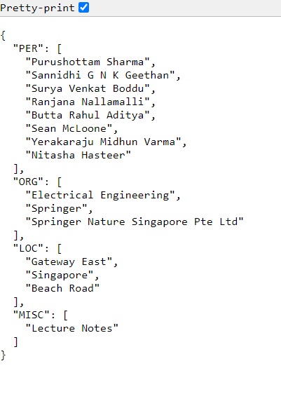

<ul>
  <li>
    <h3> Demo of Application: </h3>
    <ol><li> 
User Interface :

      
    </li>
      <li>
        
Result :

        
      </li>
    </ol>
  </li>
  <li> 
Google colab link of fine-tuning bert-large-cased :
</li>
  <li>
Link for my fine-tuned saved_model: <a href="https://drive.google.com/drive/folders/15a1TTtJhaEdHNSETsNVx4zR1oTkDs4F3?usp=sharing">saved_model</a>
</li>
</ul>
